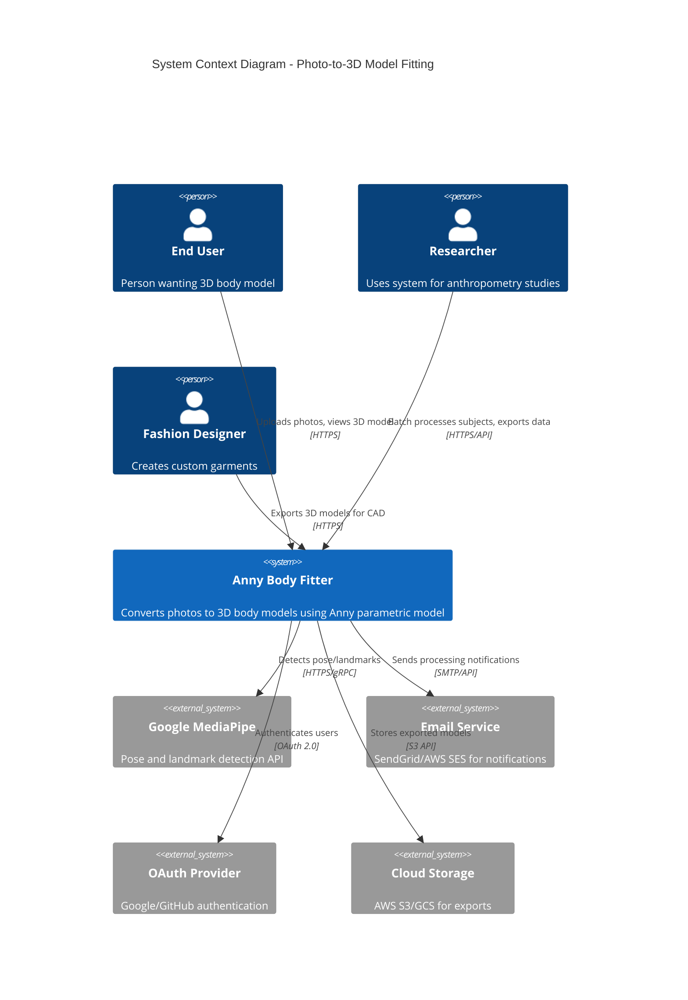

# C4 Model: Context Diagram

## System Context - Photo-to-3D-Model Fitting Application



## Key Relationships

### Users → System
- **End User**: Casual user wanting personal 3D avatar
- **Researcher**: Batch processing for anthropometry studies
- **Fashion Designer**: Export models for garment fitting

### System → External Services
- **MediaPipe**: Real-time pose estimation (33 body + 68 face + 21 hand landmarks)
- **Email Service**: Async notification when processing completes
- **OAuth Provider**: Social login (Google, GitHub)
- **Cloud Storage**: Long-term storage of exported models (OBJ, GLTF)

## Trust Boundaries

1. **Public Internet** → **API Gateway** (HTTPS, rate limiting)
2. **API Gateway** → **Backend Services** (internal network, mTLS)
3. **Backend** → **Database** (encrypted connection, row-level security)
4. **Backend** → **External APIs** (API keys, secrets management)

## Data Flows (High-Level)

```
User Photo → Upload (HTTPS) → RAM-Only Storage → Vision Processing →
Measurements → Model Fitting → 3D Model → Database (params only) →
Photo Deleted → 3D Viewer (WebGL)
```

**Critical Privacy Flow**: Photos never leave RAM, deleted <5 minutes

## System Boundaries

**Inside System**:
- Web frontend (React + Three.js)
- API server (FastAPI)
- Vision processing service
- Model fitting service (Anny)
- Database (PostgreSQL)
- Cache (Redis)

**Outside System**:
- User devices (browsers, mobile)
- External AI APIs (MediaPipe)
- Cloud infrastructure (if deployed on AWS/GCP)
- Authentication providers

## Deployment Context

### Development
- Local Docker Compose
- SQLite for rapid testing
- Mock external services

### Production
- Kubernetes cluster
- Managed PostgreSQL (RDS/Cloud SQL)
- Managed Redis (ElastiCache/Memorystore)
- CDN for frontend assets

## Revision History
| Version | Date | Changes |
|---------|------|---------|
| 1.0 | 2025-11-10 | Initial C4 context diagram |
