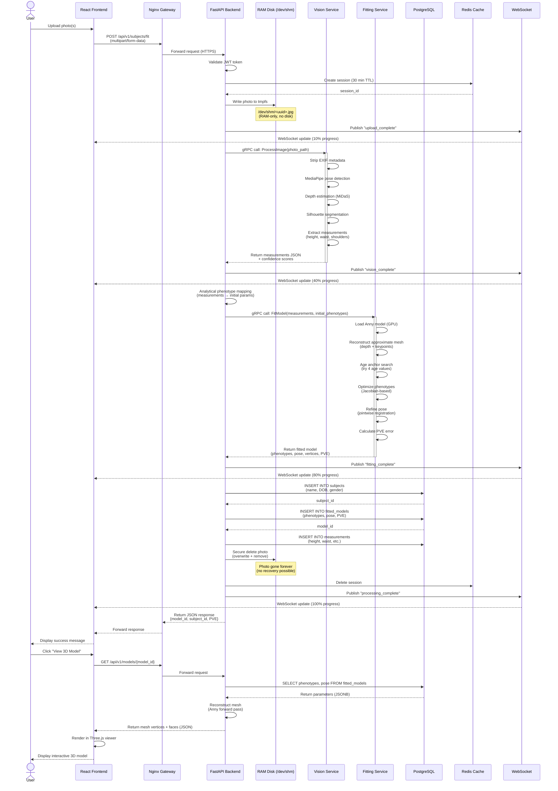
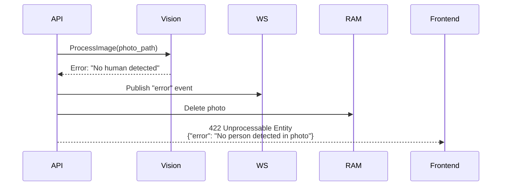
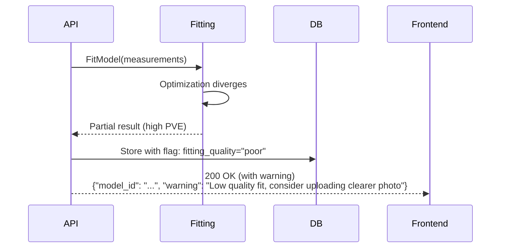
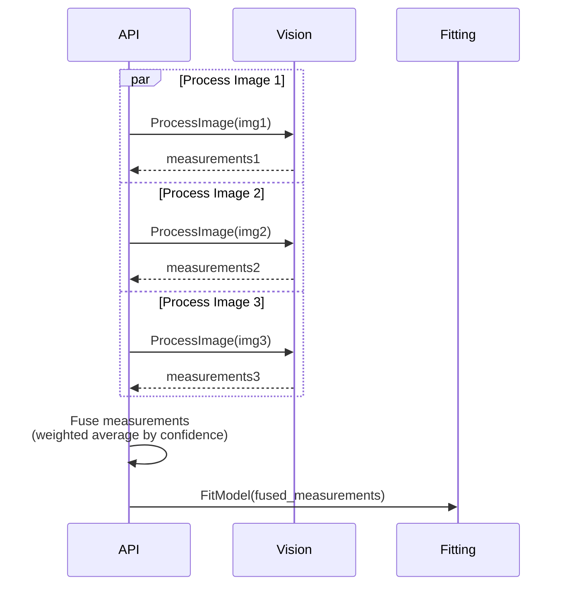

# Sequence Diagram: Photo Upload to 3D Model

## End-to-End Processing Flow

## Key Timing Constraints

| Step | Expected Duration | Timeout |
|------|------------------|---------|
| Photo upload | <2s | 30s |
| Vision processing | 3-5s | 15s |
| Model fitting | 5-8s | 30s |
| Database writes | <500ms | 5s |
| Photo deletion | <100ms | 1s |
| **Total** | **8-15s** | **60s** |

## Error Handling Scenarios

### Scenario 1: Vision Processing Failure

### Scenario 2: Fitting Convergence Failure

## WebSocket Event Types

| Event | Payload | Description |
|-------|---------|-------------|
| `upload_complete` | `{progress: 0.1}` | Photo uploaded to RAM |
| `vision_processing` | `{progress: 0.2, stage: "pose_detection"}` | Vision pipeline stage |
| `vision_complete` | `{progress: 0.4, measurements: {...}}` | Measurements extracted |
| `fitting_started` | `{progress: 0.5}` | Optimization started |
| `fitting_complete` | `{progress: 0.8, pve: 15.2}` | Fitting finished |
| `processing_complete` | `{progress: 1.0, model_id: "..."}` | Ready to view |
| `error` | `{error: "...", code: 422}` | Processing failed |

## Concurrency & Parallelization

### Parallel Vision Processing (Multiple Images)

## Security Checkpoints

1. **Authentication**: JWT validation before processing
2. **Authorization**: User can only access own subjects
3. **Input Validation**: File type, size, content checks
4. **Rate Limiting**: Max 10 uploads per hour per user
5. **EXIF Stripping**: Remove metadata immediately
6. **Secure Deletion**: Overwrite photo data before removal
7. **Audit Logging**: Log all access to subject data

## Revision History
| Version | Date | Changes |
|---------|------|---------|
| 1.0 | 2025-11-10 | Initial sequence diagram |
